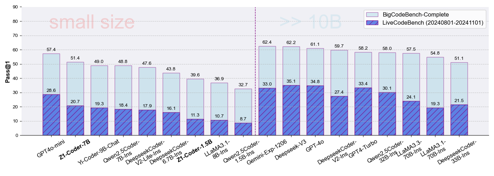
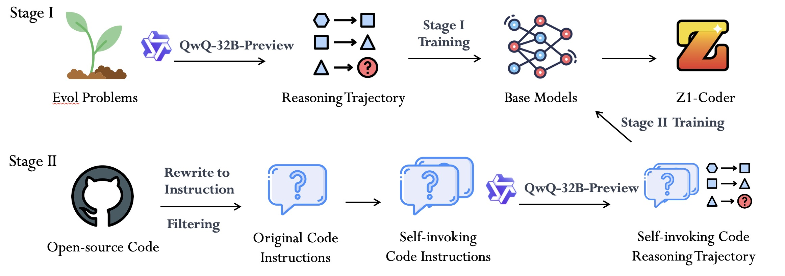
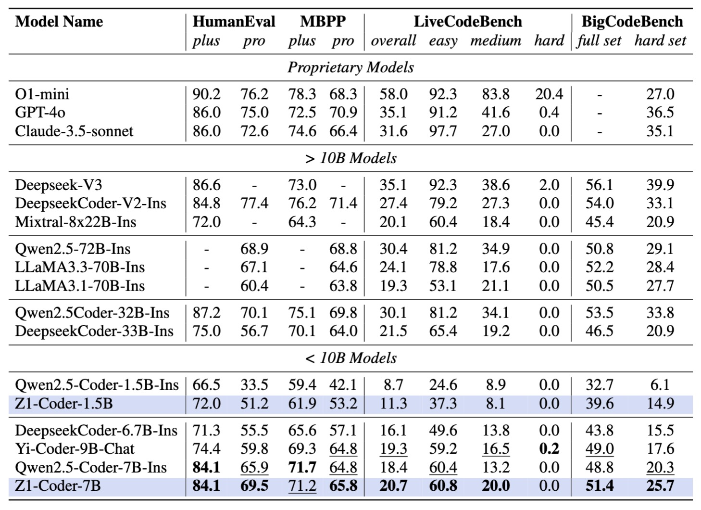

<h1 align="center">

<br>
Z1-Coder 
</h1>

<div align="center">

*Unleashing the Reasoning Power of Large Language Models to Code Generation*

<div align="center" style="font-family: Arial, sans-serif;">
  <p>
    <a href="#news" style="text-decoration: none; font-weight: bold;">News</a> •
    <a href="#links" style="text-decoration: none; font-weight: bold;">Links</a> •
    <a href="#getting-started" style="text-decoration: none; font-weight: bold;">Getting Started</a> •
    <a href="#introduction" style="text-decoration: none; font-weight: bold;">Introduction</a> •
    <a href="#evaluation" style="text-decoration: none; font-weight: bold;">Evaluation</a> •
    <a href="#citation" style="text-decoration: none; font-weight: bold;">Citation</a> 
  </p>
</div>

</div>


# News

- **[2025/01/17]** 🎉 We have released our Z1-Coder-1.5B and Z1-Coder-7B model and data through [HuggingFace](https://huggingface.co/Z1-Coder)!


# Links


- 🤗 [Z1-Coder models](https://huggingface.co/Z1-Coder)
- 🤗 [Z1-Coder data](https://huggingface.co/Z1-Coder)

# Getting Started

We open source the code and scripts we used for data curation, training, and evaluation for Z1-Coder models, you can find more details in each directory.

- ``src/eval``: Evaluation for Z1-Coder. To generate our training data, we use the QwQ-32B-Preview model. we curate reasoning trajectories on code-related datasets and propose self-invoking evolving to further refine models' reasoning behaviour in code generation. 
- ``scr/train``: Training scripts for Z1-Coder. We train all the models with Fully Shard Data Parallel (FSDP) and set a global batch size to 1024 for 3 epochs using 2 NVIDIA A800-80G GPUs. We used greedy decoding for all results, with the maximum sequence length set to 1280.
We use a learning rate of 5e-5 for the two training stages. 

# Introduction

<p align="center">
    
    <br>
    <em>Figure 1: Comparison between Z1-Coder-7B and Qwen2.5-Coder-Instruct. </em>
</p>


To train Z1-Coder, we curate reasoning trajectories on code-related datasets and propose [self-invoking](https://github.com/CodeEval-Pro/CodeEval-Pro) evolving to further refine models' reasoning behaviour in code generation. 
| Model                  | Trajectory Dataset Download       | Reference                      |
|------------------------|-----------------------------------|--------------------------------|
| SFT  *stage 1*  Data   | [Z1Coder-Evol-CoT-110K](https://huggingface.co/datasets/Z1-Coder/Z1Coder-Evol-CoT-110K)         |  https://github.com/nlpxucan/WizardLM  |
| SFT  *stage 2*  Data   | [Z1Coder-SelfInvoking-CoT-20K](https://huggingface.co/datasets/Z1-Coder/Z1Coder-SelfInvoking-CoT-20K)  | https://github.com/CodeEval-Pro/CodeEval-Pro                 |

We fine-tune Qwen-2.5-Coder-Base (1.5B and 7B) for two stages with two trajectory datasets, yielding Z1-Coder-1.5B and Z1-Coder-7B respectively.


<p align="center">
    
    <br>
    <em>Figure 2: The pipeline of Z1-Coder training. </em>
</p>


# Evaluation
Z1-Coder significantly outperforms other open-source models on different code generation benchmarks at a similar parameter size. Notably, Z1-Coder-7B surpasses the best 7B code LLMs Qwen2.5-Coder-7B-Instruct, with only its 1% post-training data. Z1-Coder-7B also achieves 20% pass@1 on LiveCodeBench and 51.4% on BigCodeBench, which performs comparable performance level compared to DeepseekCoder-33B-Instruct (21.5% and 51.1%) and LLaMA3.1-70B-Instruct (19.3% and 54.8 %). 

<p align="center">
    <em>Table 1: Pass@1(%) results of different LLMs on all benchmarks. The best results in each section are
in blue, the second-best results are underlined. </em>
    <br>
    
</p>

## Fully Open-source: Driving Progress Together
Z1-Coder-7B surpasses the best 7B code LLMs Qwen2.5-Coder-7B-Instruct, with only 1% its post-training data.

| Model                  | Z1-Coder-7B                  | Qwen2.5-Coder-7B-Ins                     |
|------------------------|------------------------------|------------------------------------------|
| Base Model             | Qwen2.5-Coder-7B             | Qwen2.5-Coder-7B                         |
| SFT Data *stage 1*     | 110K (open-source)           | 10M+ (open-source and in-house)          |
| SFT Data *stage 2*     | 20K (open-source)            | 1M+ (in-house)                           |
| Offline RL             | No                           | DPO                                      |


# Citation
The code in this repository is mostly described in the post below. Please consider citing this work if you find the repository helpful. 

```bibtex
@misc{z1-coder,
  author       = {Z1-Coder Team},
  title        = {Z1-Coder: Unleashing the Reasoning Power of Large Language Models to Code Generation},
  publisher = {GitHub},
  journal = {GitHub repository},
  howpublished = {\url{https://github.com/Z1-Coder/Z1-Coder}},
  note         = {Accessed: 2025-01-17},
  year         = {2025}
}
```
